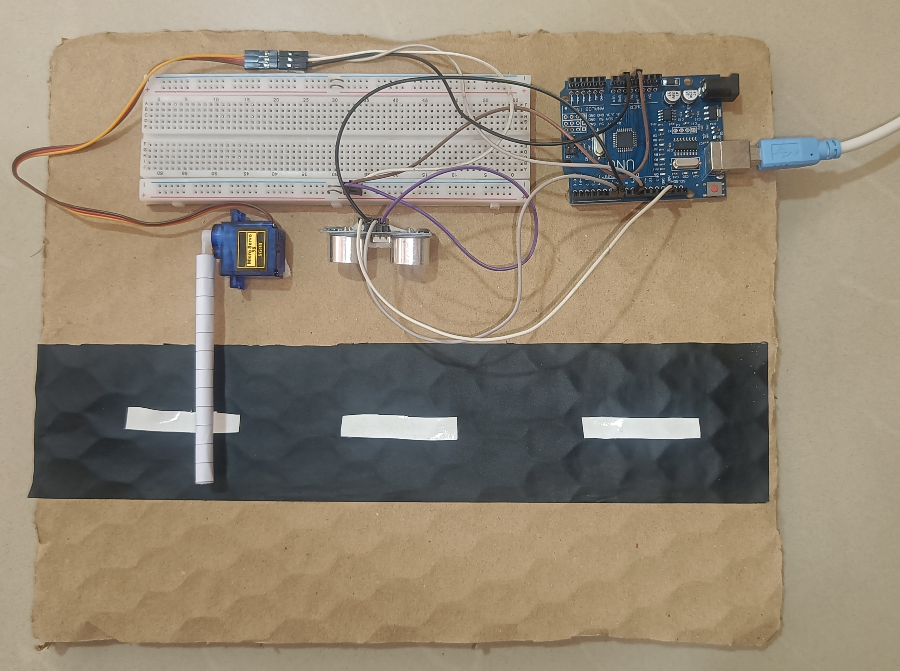
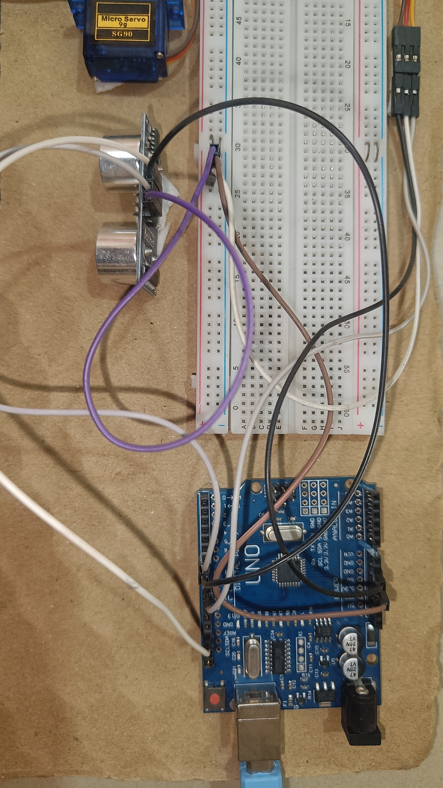
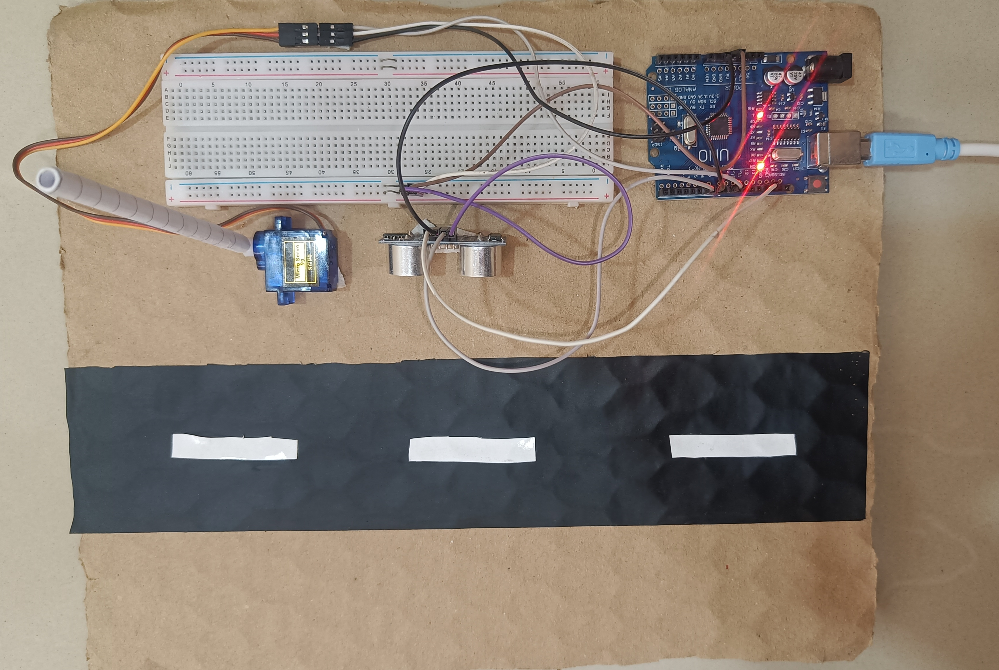

# Automatic Gate Opening using Arduino

## Overview

This project automatically opens and closes a gate using Arduino and an ultrasonic sensor.

## Components

* Arduino Uno
* Ultrasonic Sensor
* Servo Motor
* Breadboard
* Jumper wires

## Working

When an object comes near, the sensor detects it and the gate opens.
After a few seconds, the gate closes automatically.

## Output

## Author

Darshan Mali
